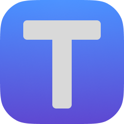

<a id="readme-top"></a>

<div align="center">

<a href="https://github.com/leonwong282/awesome-project-template">
  
</a>

# 🚀 Awesome Project Template

> A modern, beautiful, and well-structured open source project template


[🌍 English](README.md) | [🇹🇼 繁體中文](README.zh-TW.md)

[Features](#-features) • [Quick Start](#-quick-start) • [Structure](#-template-structure) • [Contributing](#-contributing)

</div>

## ✨ Features

- 📝 **Documentation-First**: Comprehensive README, contributing guides, and documentation structure
- 🤝 **GitHub Integration**: Issue templates, PR templates, and community health files
- 🌍 **Multi-Language**: README in English and Traditional Chinese
- 📋 **Community Standards**: Code of Conduct, Security Policy, and Contributing guidelines
- ⚙️ **Editor Consistency**: EditorConfig for consistent code style across editors
- 🏷️ **Conventional Commits**: Structured commit message guidelines

## 🚀 Quick Start

### Using as Template

**Method 1: GitHub Web Interface (Recommended)**
1. Click the "Use this template" button above
2. Configure your new repository
3. Start coding!

**Method 2: GitHub CLI**
```bash
gh repo create your-project-name \
  --template leonwong282/awesome-project-template \
  --public --clone
```

**Method 3: Manual Clone**
```bash
git clone https://github.com/leonwong282/awesome-project-template.git your-project
cd your-project
rm -rf .git && git init
```

### After Creating Your Project

1. **Update project information**
   - Replace "Project Name" placeholders in documentation
   - Update repository URLs to your own
   - Configure author information

2. **Add your tech stack**
   - Create `package.json`, `requirements.txt`, or your dependency file
   - Add source code directories (`src/`, `lib/`, etc.)
   - Set up your build tools and CI/CD

3. **Customize documentation**
   - Update `docs/GETTING_STARTED.md` with your setup instructions
   - Modify issue templates for your project's needs

<p align="right">(<a href="#readme-top">back to top</a>)</p>

## 🏗️ Template Structure

```
awesome-project-template/
├── 📚 docs/                     # Documentation hub
│   ├── GETTING_STARTED.md       # Setup guide template
│   └── README.md                # Documentation index
├── 🤝 .github/                  # GitHub integration
│   ├── ISSUE_TEMPLATE/          # Issue templates (bug, feature, docs, question)
│   ├── copilot-instructions.md  # AI coding assistant guidance
│   └── pull_request_template.md # PR template
├── 🖼️ images/                   # Visual assets
│   └── logo.png                 # Project logo
├── 📋 Community Files
│   ├── README.md                # This file
│   ├── README.zh-TW.md          # Traditional Chinese README
│   ├── CONTRIBUTING.md          # Contribution guidelines
│   ├── CODE_OF_CONDUCT.md       # Community standards
│   ├── SECURITY.md              # Security policy
│   ├── CHANGELOG.md             # Version history template
│   └── LICENSE                  # GPL-3.0 license
└── ⚙️ Configuration
    ├── .editorconfig            # Editor settings
    ├── .gitignore               # Git ignore patterns
    └── .gitattributes           # Git attributes
```

<p align="right">(<a href="#readme-top">back to top</a>)</p>

## 📖 Documentation

- **[📚 Documentation Hub](docs/README.md)** - Complete documentation index
- **[🚀 Getting Started](docs/GETTING_STARTED.md)** - Setup instructions template
- **[🤝 Contributing](CONTRIBUTING.md)** - How to contribute

<p align="right">(<a href="#readme-top">back to top</a>)</p>

## 🤝 Contributing

We welcome contributions! Please see our [Contributing Guide](CONTRIBUTING.md) for details.

### Quick Contribution Steps

1. Fork the repository
2. Create your feature branch (`git checkout -b feature/AmazingFeature`)
3. Commit your changes (`git commit -m 'feat: add some AmazingFeature'`)
4. Push to the branch (`git push origin feature/AmazingFeature`)
5. Open a Pull Request

<p align="right">(<a href="#readme-top">back to top</a>)</p>

## 📋 Roadmap

- [x] Core template structure
- [x] GitHub issue/PR templates
- [x] Multi-language README
- [x] Community health files
- [ ] CI/CD workflow templates
- [ ] Docker configuration templates
- [ ] Additional language READMEs

See the [open issues](https://github.com/leonwong282/awesome-project-template/issues) for more.

<p align="right">(<a href="#readme-top">back to top</a>)</p>

## 📄 License

This project is licensed under the GPL-3.0 License - see the [LICENSE](LICENSE) file for details.

## 👥 Author

**Leon Wong** - [leonwong282](https://github.com/leonwong282)

## 🙏 Acknowledgments

- [Best-README-Template](https://github.com/othneildrew/Best-README-Template)
- [Contributor Covenant](https://www.contributor-covenant.org/)
- [Keep a Changelog](https://keepachangelog.com/)
- [Shields.io](https://shields.io/)

## 📞 Support

- 📝 [Open an issue](https://github.com/leonwong282/awesome-project-template/issues/new)
- 💬 [Start a discussion](https://github.com/leonwong282/awesome-project-template/discussions)
- 📧 Email: leonwong282@gmail.com

---

<div align="center">

**⭐ Star this repository if it helped you!**

Made with ❤️ by [Leon](https://github.com/leonwong282)

</div>
