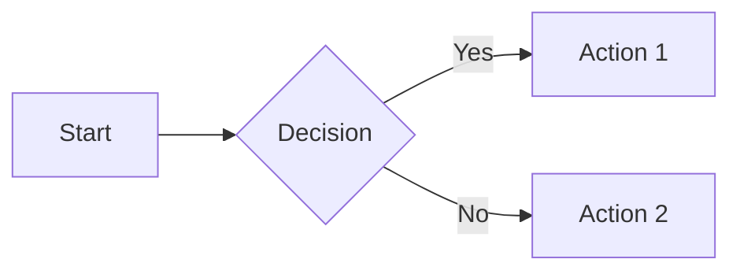

# Docusaurus Guide

This guide covers how to use and customize the Docusaurus documentation site in this template.

## Quick Start

### Prerequisites

- Node.js 18.0 or higher
- npm or yarn package manager

### Installation

```bash
# Navigate to the docs folder
cd docs

# Install dependencies
npm install

# Start development server
npm run start
```

The site will be available at `http://localhost:3000`.

### Build for Production

```bash
# Build the static site
npm run build

# Preview the production build
npm run serve
```

## Project Structure

```
docs/
├── docs/                    # Documentation content (Markdown/MDX)
│   ├── intro.md            # Landing page for /docs
│   ├── guides/             # How-to guides
│   ├── reference/          # API/reference documentation
│   ├── community/          # Community guidelines
│   └── decisions/          # Architecture Decision Records
├── src/
│   ├── components/         # React components
│   ├── css/               # Custom styles
│   ├── pages/             # Custom pages (landing, etc.)
│   └── theme/             # Theme overrides
├── static/                 # Static assets (images, files)
├── i18n/                   # Internationalization files
├── docusaurus.config.js    # Main configuration
├── sidebars.js            # Sidebar navigation
└── package.json           # Dependencies
```

## Writing Documentation

### Basic Markdown

Create a new `.md` file in the `docs/` folder:

```markdown
---
id: my-doc
title: My Document
sidebar_label: My Doc
sidebar_position: 1
---

# My Document

Your content here...
```

### Front Matter Options

| Field | Description |
|-------|-------------|
| `id` | Unique document ID (used in URLs and links) |
| `title` | Document title (shown in browser tab) |
| `sidebar_label` | Short label for sidebar |
| `sidebar_position` | Order in sidebar (lower = higher) |
| `description` | Meta description for SEO |
| `keywords` | SEO keywords array |
| `tags` | Document tags for grouping |
| `hide_title` | Hide the title heading |
| `hide_table_of_contents` | Hide the TOC |
| `draft` | Hide in production if `true` |

### Linking Between Documents

```markdown
<!-- Relative link (recommended) -->
[Getting Started](./GETTING_STARTED.md)

<!-- By document ID -->
[Contributing](/docs/reference/contributing)

<!-- With anchor -->
[Installation Section](./GETTING_STARTED.md#installation)
```

### Adding Images

Place images in `static/img/` and reference them:

```markdown

```

Or use relative paths for co-located images:

```markdown

```

## MDX Features

Docusaurus supports MDX, allowing React components in Markdown.

### Admonitions (Callouts)

```markdown
:::note
This is a note.
:::

:::tip
Pro tip here!
:::

:::info
Informational content.
:::

:::warning
Be careful!
:::

:::danger
Critical warning!
:::
```

### Code Blocks

````markdown
```javascript title="example.js"
const greeting = 'Hello, World!';
console.log(greeting);
```

```python {2-3} showLineNumbers
def hello():
    # These lines are highlighted
    print("Hello, World!")
```
````

### Tabs

```jsx
import Tabs from '@theme/Tabs';
import TabItem from '@theme/TabItem';

<Tabs>
  <TabItem value="npm" label="npm" default>
    npm install package-name
  </TabItem>
  <TabItem value="yarn" label="Yarn">
    yarn add package-name
  </TabItem>
</Tabs>
```

### Mermaid Diagrams

This template has Mermaid enabled. Create diagrams in Markdown:

````markdown

````

## Sidebar Configuration

Edit `sidebars.js` to customize navigation:

```javascript
const sidebars = {
  docsSidebar: [
    // Single document
    {
      type: 'doc',
      id: 'intro',
      label: '🚀 Getting Started',
    },
    // Category with items
    {
      type: 'category',
      label: '📚 Guides',
      collapsed: false, // Start expanded
      items: [
        'guides/GETTING_STARTED',
        'guides/DOCUSAURUS_GUIDE',
        // Nested category
        {
          type: 'category',
          label: '⚙️ Advanced',
          items: ['guides/SEARCH_GUIDE'],
        },
      ],
    },
    // Auto-generated from folder
    {
      type: 'autogenerated',
      dirName: 'reference',
    },
    // External link
    {
      type: 'link',
      label: 'GitHub',
      href: 'https://github.com/your-repo',
    },
  ],
};
```

## Configuration

### docusaurus.config.js

Key configuration options:

```javascript
const config = {
  title: 'Your Site Title',
  tagline: 'Your tagline',
  url: 'https://your-domain.com',
  baseUrl: '/',
  
  // Behavior on broken links
  onBrokenLinks: 'throw',
  onBrokenMarkdownLinks: 'warn',
  
  // Internationalization
  i18n: {
    defaultLocale: 'en',
    locales: ['en', 'zh-TW'],
  },
  
  // Theme configuration
  themeConfig: {
    navbar: { /* ... */ },
    footer: { /* ... */ },
    colorMode: {
      defaultMode: 'light',
      respectPrefersColorScheme: true,
    },
  },
};
```

### Adding Navbar Items

```javascript
navbar: {
  title: 'My Site',
  logo: {
    alt: 'Logo',
    src: 'img/logo.svg',
  },
  items: [
    // Link to docs
    {
      type: 'docSidebar',
      sidebarId: 'docsSidebar',
      label: 'Docs',
      position: 'left',
    },
    // External link
    {
      href: 'https://github.com/your-repo',
      label: 'GitHub',
      position: 'right',
    },
    // Language dropdown
    {
      type: 'localeDropdown',
      position: 'right',
    },
  ],
},
```

## Internationalization (i18n)

### Translating Documents

1. Copy the document to the locale folder:
   ```
   docs/i18n/zh-TW/docusaurus-plugin-content-docs/current/
   ```

2. Translate the content while keeping the same filename.

### Translating UI Strings

Edit `i18n/zh-TW/code.json`:

```json
{
  "theme.common.editThisPage": {
    "message": "編輯此頁",
    "description": "The link label to edit the current page"
  }
}
```

### Building for All Locales

```bash
# Build all locales
npm run build

# Start dev server with specific locale
npm run start -- --locale zh-TW
```

## Customization

### Custom CSS

Edit `src/css/custom.css`:

```css
:root {
  --ifm-color-primary: #667eea;
  --ifm-code-font-size: 95%;
}

[data-theme='dark'] {
  --ifm-color-primary: #8099f4;
}
```

### Custom Components

Create components in `src/components/`:

```jsx
// src/components/MyComponent/index.js
import React from 'react';
import styles from './styles.module.css';

export default function MyComponent({ title, children }) {
  return (
    <div className={styles.container}>
      <h3>{title}</h3>
      {children}
    </div>
  );
}
```

Use in MDX:

```markdown
import MyComponent from '@site/src/components/MyComponent';

<MyComponent title="Hello">
  Content here
</MyComponent>
```

### Theme Overrides (Swizzling)

Override theme components:

```bash
# See available components
npm run swizzle @docusaurus/theme-classic -- --list

# Eject a component (full copy)
npm run swizzle @docusaurus/theme-classic Footer -- --eject

# Wrap a component (extend)
npm run swizzle @docusaurus/theme-classic Footer -- --wrap
```

## Plugins

### Installed Plugins

This template includes:

| Plugin | Purpose |
|--------|---------|
| `@docusaurus/theme-mermaid` | Diagram support |
| `@easyops-cn/docusaurus-search-local` | Offline search |
| `@docusaurus/plugin-pwa` | Progressive Web App |

### Adding Plugins

1. Install the package:
   ```bash
   npm install @docusaurus/plugin-ideal-image
   ```

2. Add to `docusaurus.config.js`:
   ```javascript
   plugins: [
     ['@docusaurus/plugin-ideal-image', {
       quality: 70,
       max: 1030,
       min: 640,
     }],
   ],
   ```

## Deployment

### GitHub Pages

```bash
# Set environment variables
export GIT_USER=<your-github-username>

# Deploy
npm run deploy
```

### Other Platforms

Build the static site and deploy the `build/` folder:

| Platform | Command |
|----------|---------|
| Vercel | Connect repo, auto-deploys |
| Netlify | Build command: `npm run build`, publish: `build` |
| Cloudflare Pages | Same as Netlify |

## Common Tasks

### Add a New Guide

1. Create `docs/guides/MY_NEW_GUIDE.md`
2. Add front matter with title and position
3. Add to `sidebars.js` if not using autogenerated

### Update Navigation

Edit `sidebars.js` for sidebar, `docusaurus.config.js` for navbar/footer.

### Add a Blog

Uncomment blog plugin in `docusaurus.config.js`:

```javascript
presets: [
  ['classic', {
    blog: {
      showReadingTime: true,
      blogSidebarCount: 'ALL',
    },
  }],
],
```

### Enable Search

This template uses local search. For production sites, consider [Algolia DocSearch](./SEARCH_GUIDE.md).

## Troubleshooting

### Common Issues

| Issue | Solution |
|-------|----------|
| Broken links error | Check file paths, use relative links |
| Build fails | Run `npm run clear` then rebuild |
| Styles not updating | Clear browser cache, restart dev server |
| i18n not working | Ensure locale folder structure matches |

### Useful Commands

```bash
# Clear cache
npm run clear

# Type check
npm run typecheck

# Write translations
npm run write-translations

# Upgrade Docusaurus
npm update @docusaurus/core @docusaurus/preset-classic
```

## Resources

- [Docusaurus Documentation](https://docusaurus.io/docs)
- [MDX Documentation](https://mdxjs.com/)
- [Infima CSS Framework](https://infima.dev/)
- [Docusaurus Community Discord](https://discord.gg/docusaurus)
