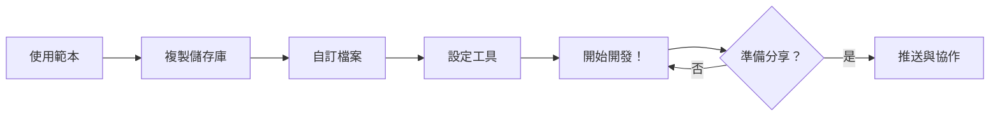

# 🚀 快速開始

歡迎使用 **精選專案範本** - 一個美觀、以文件為優先的開源專案範本！

## 這個範本是什麼？

這是一個 **GitHub 範本儲存庫**，提供：

- 📋 **社群健康檔案** - Issue 範本、PR 範本、行為準則
- 📚 **文件結構** - 即用型文件資料夾與指南
- ⚙️ **開發工具** - EditorConfig、pre-commit hooks、CI/CD 工作流程
- 🔒 **安全最佳實踐** - 安全政策、依賴套件管理
- 📄 **授權條款指導** - 協助選擇正確的開源授權條款

## 快速入門

### 1. 使用此範本

在 [GitHub](https://github.com/leonwong282/awesome-project-template) 上點擊 **「Use this template」** 按鈕來建立您自己的儲存庫。

### 2. 複製您的儲存庫

```bash
git clone https://github.com/YOUR_USERNAME/YOUR_PROJECT.git
cd YOUR_PROJECT
```

### 3. 自訂設定

替換以下檔案中的預設值：

| 檔案 | 需要更新的內容 |
|------|----------------|
| `README.md` | 專案名稱、描述、徽章 |
| `SECURITY.md` | 您的安全聯絡信箱 |
| `CODE_OF_CONDUCT.md` | 您的聯絡信箱 |
| `.github/CODEOWNERS` | 您的 GitHub 使用者名稱 |
| `.github/FUNDING.yml` | 您的贊助連結 |

### 4. 設定開發工具

```bash
# 安裝 pre-commit hooks
pip install pre-commit
pre-commit install

# 驗證 EditorConfig（確認您的編輯器已安裝相關外掛）
cat .editorconfig
```

### 5. 開始開發！ 🎉

新增您的原始碼並開始開發。

## 工作流程概覽



## 範本結構

```
awesome-project-template/
├── .github/
│   ├── ISSUE_TEMPLATE/      # Issue 範本（錯誤、功能、文件、問題）
│   ├── workflows/           # CI/CD 工作流程
│   ├── CODEOWNERS           # 程式碼擁有者
│   ├── FUNDING.yml          # 贊助設定
│   └── pull_request_template.md
├── docs/                    # 文件（您正在這裡！）
├── images/                  # 專案圖片和標誌
├── .editorconfig            # 編輯器設定
├── .pre-commit-config.yaml.example  # Pre-commit hooks 範本
├── CHANGELOG.md             # 版本歷程
├── CODE_OF_CONDUCT.md       # 社群準則
├── CONTRIBUTING.md          # 貢獻指南
├── LICENSE                  # GPL-3.0 授權條款
├── README.md                # 主要說明文件（英文）
├── README.zh-TW.md          # 主要說明文件（繁體中文）
└── SECURITY.md              # 安全政策
```

## 學習資源

### 入門者適用

從這些指南開始：

1. **[EditorConfig 指南](/docs/guides/EDITORCONFIG_GUIDE)** - 學習設定一致的程式碼風格
2. **[Pre-commit 指南](/docs/guides/PRECOMMIT_GUIDE)** - 自動化程式碼品質檢查

## 需要幫助？

- 📖 瀏覽文件
- 🐛 [回報錯誤](https://github.com/leonwong282/awesome-project-template/issues/new?template=bug_report.yml)
- 💡 [請求新功能](https://github.com/leonwong282/awesome-project-template/issues/new?template=feature_request.yml)
- 💬 [提出問題](https://github.com/leonwong282/awesome-project-template/issues/new?template=question.yml)

## 貢獻

我們歡迎貢獻！詳情請參閱 [貢獻指南](/docs/reference/contributing)。

---

**準備深入了解？** 請查看 [EditorConfig 指南](/docs/guides/EDITORCONFIG_GUIDE) 或 [Pre-commit 指南](/docs/guides/PRECOMMIT_GUIDE)！
